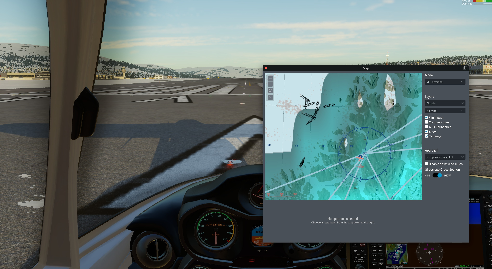

# xa-snow plugin for X-Plane

Accumulated snow for X-Plane 12 created by https://github.com/zodiac1214 .

The plugin downloads "Accumulated Snow Depth" information from NOAA and depicts it in X-Plane 12.




Download the latest (non-beta-)release here:   https://github.com/hotbso/xa-snow/releases/latest

You can see all releases including betas here: https://github.com/hotbso/xa-snow/releases

Support Discord: https://discord.gg/dN9gvFdfAZ

## How it works
Each 6 hours NOAA creates a worldwide _6-hour forecast_ of accumulated snow based on satellite IR imagery and NOAA's forecast models.
The plugin retrieves the closest 6 hour old forecast in the hope that this forecast reflects the snow cover _now_.
The resolution of data is 0.25° lat/lon and that is appr. 10km x 20km at 50° latitude. It's no problem to place a medium sized city within one mesh rectangle.

### Depiction in X-Plane
X-Plane depicts a snow cover only as 'regional weather' meaning you can only see the same snow cover **everywhere**.
Xa-snow uses the **snow depth below your plane and not where you are looking to**.\
_The plugin tries to overcome this by temporal and spatial interpolation._

### Shoreline snow
Like each camera can be blinded by bright light IR-imagery can be blinded by hot spots.
Usually water is much warmer than land and that is in particular true at Europe's west coast due to the gulf stream.
As result raw NOAA data virtually never reports snow for many shorelines.\
_The plugin tries to overcome this by extrapolation of close inland snow to the shoreline._

### Approaching a shoreline over water
_Below your plane_ over water there is no snow so you won't see snow.\
_The plugin tries to overcome this by finding the nearest point on the shoreline and using that (extrapolated) snow depth ._

### Result
All in all this gives a pleasing rendition as you fly along - or not.

- in an external view the snow is suddenly gone: yes, remember the snow _below your plane_ is depicted everywhere. Just look out of the front window for best results
- resolution is too coarse grained: you see the same snow everywhere and suddenly it's all gone
- you overfly an isolated snowy peak: suddenly you have snow everywhere, a few seconds later it's all gone
- high snowy mountains _very_ close to a _very_ warm shoreline: it's 20° Celsius and you have snow (e.g. Nice and Adriatic Sea)
- you approach a rough shoreline with many fjords: you see snow and suddenly it's all gone


## Installation
Just unpack the zip in your <X Plane>/Resources/plugins directory.

After you've installed it once skunkcrafts updater will take care.
Be sure you select the right channel PROD or BETA. Only use BETA if you fully understand how skunkcrafts works.

Download link for skunkcrafts updater:

https://forums.x-plane.org/index.php?/forums/topic/292710-skunkcrafts-updater-standalone-client/

## Usage
Operation is fully automatic. Nevertheless there are some options to tailor your experience:

### Menu options

**Toggle Override**\
xa-snow normally does not download snow data when you use "Manual Weather" in X-Plane in order to not ruin your summer scenery in the
simulator when it's actually winter outside.\
If you use ASXP you must have "Manual Weather" enabled so setting "Override" mode overrides the default behaviour and *does download snow data*.

**Lock Elsa Up**\
Lock Elsa up to reduce ice on runways and taxiways.

**Enable Historical Snow**\
As default xa-snow downloads the snow depth for the current wall clock time. \
We are trying to keep an archive of the 365 days of snow data although there may be gaps and delays. When you enable this option xa-snow
tries to download snow data of the data and time you've set up **before starting the flight**.\
This may work for you or not.

**Enable Snow Depth Auto Update**\
When enabled during a longer a flight xa-snow updates snow depth data. As downloading and (one-time) preprocessing of snow data is quite resource heavy use this option with care.\
As this may lead to stability issues the option may go away in future updates.

### Limit snow for legacy airports
Legacy (= mostly XP11) sceneries do not feature weather aware textures and show way too much snow making runways and taxiways unusable.
Unfortunately there are even different generations of 'legacy' that cannot be detected automatically.

You can limit the maximum amount of snow via a config file per scenery. A sample file ```xa-snow.cfg-sample``` explaining typical configurations is in the the plugin directory.\
Copy this over into your scenery directory, rename it to ```xa-snow.cfg``` and edit to your liking.

When you approach such an airport snow depth is smoothly reduced to the defined limit value to be reached at appr. the airport boundary.

## Credits
zodiac1214 for creating the plugin https://github.com/zodiac1214 \
randy408 for providing libspng https://github.com/randy408/libspng, see LICENSE-libspng\
go to C++ conversion with help of https://www.codeconvert.ai/golang-to-c++-converter

